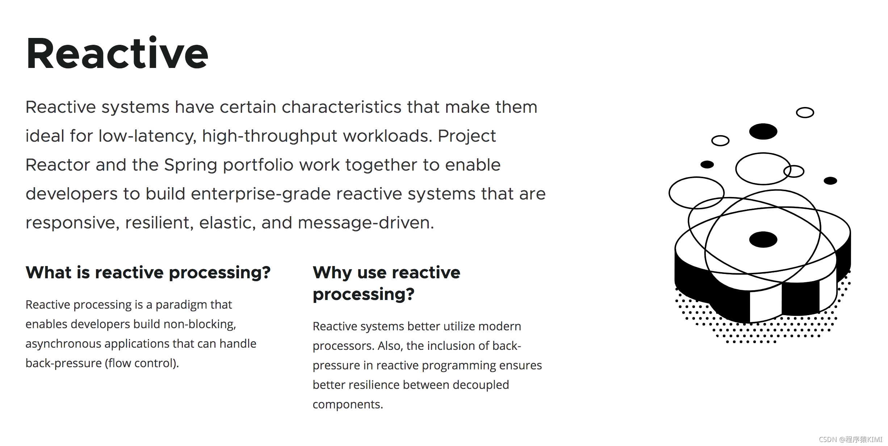
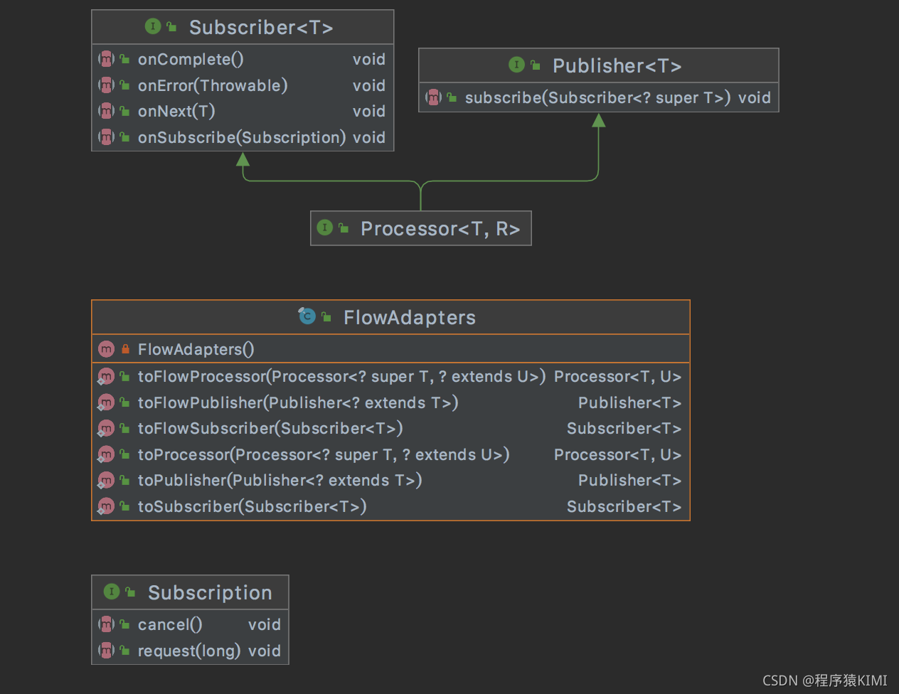
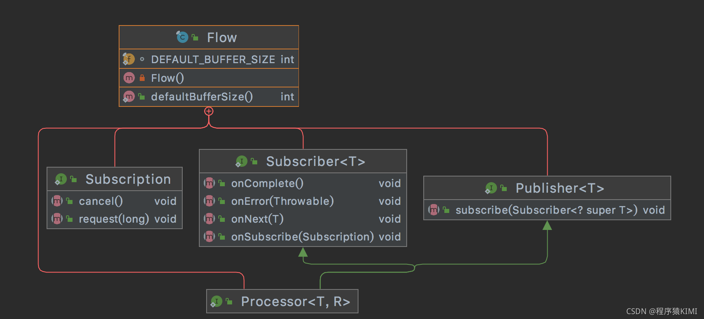
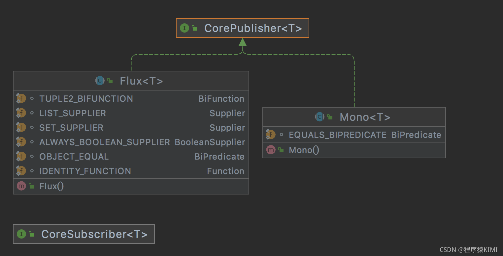
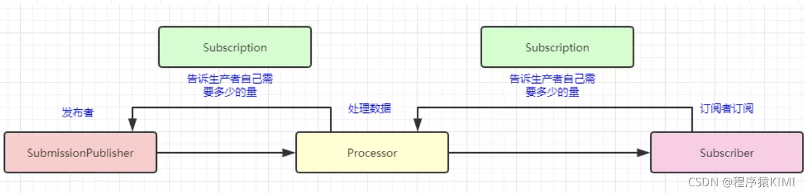
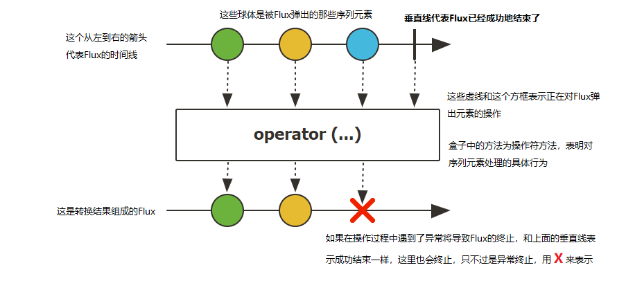
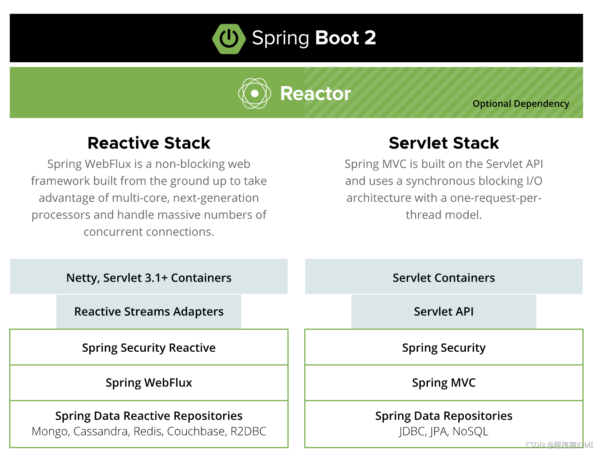
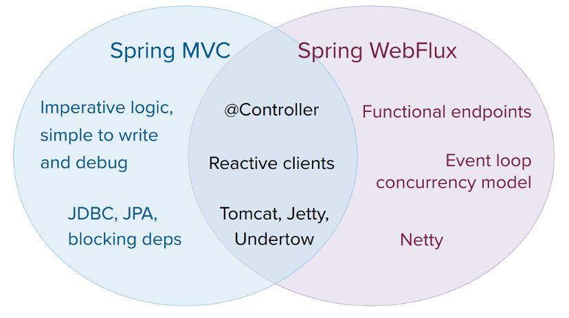

**目录**

[什么是响应式编程](#%E4%BB%80%E4%B9%88%E6%98%AF%E5%93%8D%E5%BA%94%E5%BC%8F%E7%BC%96%E7%A8%8B "什么是响应式编程")

[响应式编程定义](#%E5%93%8D%E5%BA%94%E5%BC%8F%E7%BC%96%E7%A8%8B%E5%AE%9A%E4%B9%89 "响应式编程定义")

[Spring对Reactive的解释](#Spring%E5%AF%B9Reactive%E7%9A%84%E8%A7%A3%E9%87%8A "Spring对Reactive的解释")

[Reactivestream中响应式编程](#reactivestream%E4%B8%AD%E5%93%8D%E5%BA%94%E5%BC%8F%E7%BC%96%E7%A8%8B "Reactivestream中响应式编程")

[java9中响应式编程](#java9%E4%B8%AD%E5%93%8D%E5%BA%94%E5%BC%8F%E7%BC%96%E7%A8%8B "java9中响应式编程")

[什么是Reactive](#%E4%BB%80%E4%B9%88%E6%98%AFReactive "什么是Reactive")

[Reactive之Mono类](#Reactive%E4%B9%8BMono%E7%B1%BB "Reactive之Mono类")

[Reactive之Flux类](#Reactive%E4%B9%8BFlux%E7%B1%BB "Reactive之Flux类")

[什么是WebFlux](#%E4%BB%80%E4%B9%88%E6%98%AFWebFlux "什么是WebFlux")

[WebFlux的几个关键概念](#WebFlux%E7%9A%84%E5%87%A0%E4%B8%AA%E5%85%B3%E9%94%AE%E6%A6%82%E5%BF%B5 "WebFlux的几个关键概念")

[为什么需要WebFlux](#%E4%B8%BA%E4%BB%80%E4%B9%88%E9%9C%80%E8%A6%81WebFlux "为什么需要WebFlux")

[WebFlux实际场景](#WebFlux%E5%AE%9E%E9%99%85%E5%9C%BA%E6%99%AF "WebFlux实际场景")

[WebFlux使用避坑](#WebFlux%E4%BD%BF%E7%94%A8%E9%81%BF%E5%9D%91 "WebFlux使用避坑")

[参考文章](#%E5%8F%82%E8%80%83%E6%96%87%E7%AB%A0 "参考文章")

* * *

## 什么是响应式编程

### 响应式编程定义

reactive programming is a declarative programming paradigm concerned with data streams and the propagation of
change。而这个定义也约定了

对于响应式编程，有很多种解释，比如很多人举例的excel表格的例子，Excel有函数Avg和Sum，当某一列的数据变化後，其对应的Sum函数也会相应的变化，也就是变化传递的思想。类似，一个数据流，当一个数据改变之后，其对应的函数值也会相应变化。举个例子，java8中的IntStream.of(
nums).parallel().sum()这种函数，这是一种数据流式处理的思想，但是这是缺少响应式编程定义的propagation of
change变化传递，因此不能算响应式。

java9中新增了响应式编程支持，这里响应式流(Reactive Streams)通过定义一组实体，接口和互操作方法，给出了实现异步非阻塞**背压**
的标准。第三方遵循这个标准来实现具体的解决方案，常见的有Reactor，RxJava，Akka Streams，Ratpack等。。

### Spring对Reactive的解释



### Reactivestream中响应式编程

org.reactivestreams中reactive-stream对响应式编程有了关键的接口定义。先上类结构图，从下面的类图中可以发现，这个思想怎么和消息中间件有点类似呢，一个发布者Publisher，一个订阅者Subscriber，一个Processor和Kafka中的broker也可以对应起来，这里在细看Processor的接口定义会发现，其就是将Subscriber和Publisher串起来的关键角色。



```java
public interface Processor<T, R> extends Subscriber<T>, Publisher<R> {
}
```

> * Publisher（发布者)相当于生产者(Producer)
>
> * Subscriber(订阅者)相当于消费者(Consumer)
>
> * Processor就是在发布者与订阅者之间处理数据用的
>
>
> 在响应式流上提到了back pressure（背压)这么一个概念，其实非常好理解。在响应式流实现异步非阻塞是基于生产者和消费者模式的，而生产者消费者很容易出现的一个问题就是：
**生产者生产数据多了，就把消费者给压垮了**。
>
> 而背压说白了就是：**消费者能告诉生产者自己需要多少量的数据**。这里就是**Subscription**接口所做的事。

### java9中响应式编程

java9中引入了Flow类，这个类就是对响应式编程规范的具体支持，其组合关系和内部方法如下，可以看到和reactivestream几乎一模一样，这里就不做过多描述。



##  

## 什么是Reactive

看过SpringGateway的源码会发现，里面大量使用reactive思路和reactivestreams里面的类。

而reactor.core是对reactivestreams中定义的接口进行实际实现，核心的几个类如Mono、Flux，待会我们介绍，先看一下类图



Reactive流的主要特征是“back
pressure后压”：也就是说，系统会在它的请求buffer被充满时，将其推送会给发送者，让发送者稍后再试，或者使用其他接收器，这就能确保发送者和接收者之间的管道不会被充满，这样才有机会获得一个响应式系统。



### Reactive之Mono类

`Mono`是一个发出(emit)`0-1`个元素的`Publisher<T>`,可以被`onComplete`信号或者`onError`信号所终止。


### Reactive之Flux类

`Flux`是一个发出(emit)`0-N`个元素组成的异步序列的`Publisher<T>`,可以被`onComplete`信号或者`onError`
信号所终止。在响应流规范中存在三种给下游消费者调用的方法`onNext`,`onComplete`, 和`onError`。下面这张图表示了Flux的抽象模型：



## 什么是WebFlux

Spring 5新加入的响应式流编程技术栈是其主打核心特性，最低Springbooot2.0，底层使用Netty，这个从搭建好项目启动日志中能看出来。

### WebFlux的几个关键概念

_**1.**Router Functions_: 对标@Controller，@RequestMapping等标准的Spring MVC注解，提供一套函数式风格的API，用于创建Router，Handler和Filter。

_**2.**WebFlux_: 核心组件，协调上下游各个组件提供响应式编程支持。

_**3.**Reactive Stream_s: 一种支持背压（Backpressure）的异步数据流处理标准，主流实现有RxJava和Reactor，Spring
WebFlux默认集成的是Reactor,

### 为什么需要WebFlux

很多朋友会说我们有了异步非阻塞，为什么还需要webFlux，这里的具体原因有以下几点。

WebFlux使用的是Reactor响应式流，里边提供了一系列的API供我们去处理逻辑，而WebFlux使用起来可以像使用SpringMVC一样**，同时**
WebFlux也可以使用[Functional Endpoints](https://www.oschina.net/action/GoToLink?url=https%3A%2F%2Fdocs.spring.io%2Fspring%2Fdocs%2Fcurrent%2Fspring-framework-reference%2Fweb-reactive.html%23webflux-fn "Functional Endpoints")
方式编程，总的来说还是要比`回调/CompletableFuture`要简洁和易编写。

Spring WebFlux在应对高并发的请求时，借助于异步IO，能够以少量而稳定的线程处理更高吞吐量的请求，尤其是当请求处理过程如果因为业务复杂或IO阻塞等导致处理时长较长时，对比更加显著。

使用WebFlux的好处是**只需要在程序内启动少量线程扩展，而不是水平通过集群扩展。异步能够规避文件IO/网络IO阻塞所带来的线程堆积
**。

> The key expected benefit of reactive and non-blocking is the ability to scale with a small, fixed number of threads
> and less memory.That makes applications more resilient under load, because they scale in a more predictable way

### WebFlux实际场景

> SpringMVC和WebFlux更多的是互补关系，而不是替换。阻塞的场景该SpringMVC还是SpringMVC，并不是WebFlux出来就把SpringMVC取代了。



* **WebFlux需要非阻塞的业务代码**，如果阻塞，需要自己开线程池去运行。WebFlux什么场景下可以替换SpringMVC呢？

* **想要内存和线程数较少的场景**
* **网络较慢或者IO会经常出现问题的场景**

### WebFlux使用避坑

1）如果原先使用用SpringMVC好好的话，则没必要迁移。因为命令式编程是编写、理解和调试代码的最简单方法。因为老项目的类库与代码都是基于阻塞式的。

2）如果你的团队打算使用非阻塞式web框架，WebFlux确实是一个可考虑的技术路线，而且它支持类似于SpringMvc的Annotation的方式实现编程模式，也可以在微服务架构中让WebMvc与WebFlux共用Controller，切换使用的成本相当小

3）在SpringMVC项目里如果需要调用远程服务的话，你不妨考虑一下使用WebClient，而且方法的返回值可以考虑使用Reactive
Type类型的，当每个调用的延迟时间越长，或者调用之间的相互依赖程度越高，其好处就越大

## 参考文章

[外行人都能看懂的WebFlux，错过了血亏](https://mp.weixin.qq.com/s?__biz=MzI4Njg5MDA5NA==&mid=2247486015&idx=1&sn=c80cd5de903510567b86697d03c892ea&chksm=ebd74b3edca0c228fb477587c5746b7867ff465f2a2e012cf6170300f70a2050f77bc6df4256&token=1874664226&lang=zh_CN#rd "外行人都能看懂的WebFlux，错过了血亏")

[Spring Web Flow Reference Guide](https://docs.spring.io/spring-webflow/docs/2.5.1.RELEASE/reference/html/ "Spring Web Flow Reference Guide")

[学习WebFlux时常见的问题 - Java3y的个人空间 - OSCHINA - 中文开源技术交流社区](https://my.oschina.net/u/3777556/blog/3138745 "学习WebFlux时常见的问题 - Java3y的个人空间 - OSCHINA - 中文开源技术交流社区")

[Reactive响应式/反应式编程 -解道Jdon](https://www.jdon.com/reactive.html "Reactive响应式/反应式编程 -解道Jdon")

[Java反应式框架Reactor中的Mono和Flux - 知乎](https://zhuanlan.zhihu.com/p/251238873 "Java反应式框架Reactor中的Mono和Flux - 知乎")
